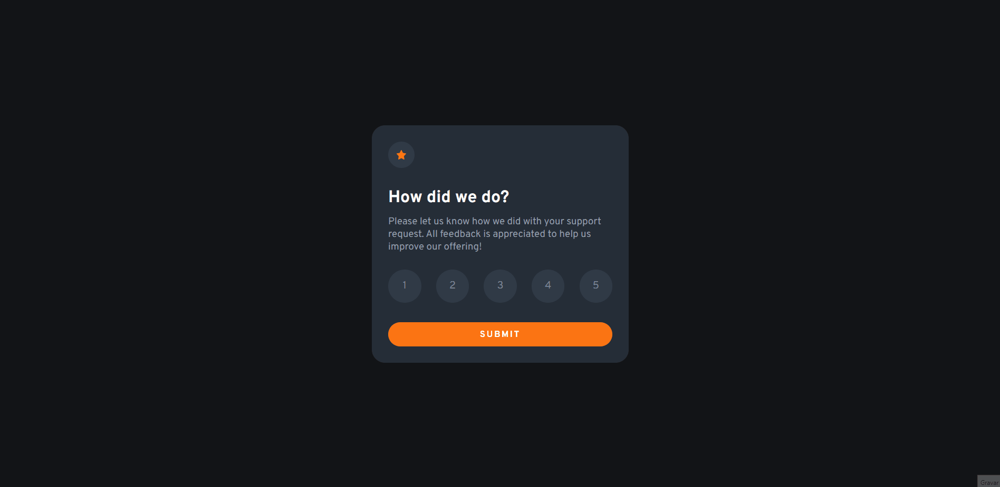
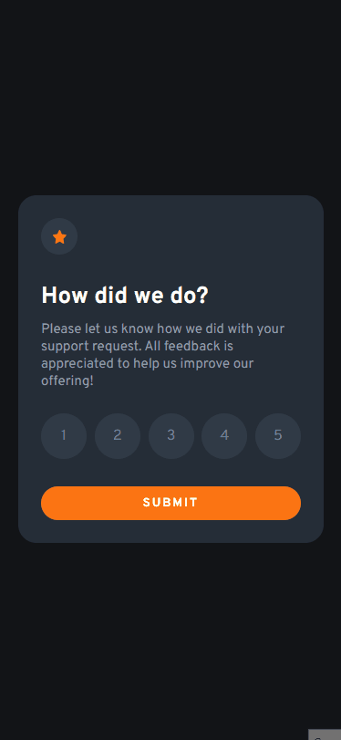

# Frontend Mentor - Interactive rating component solution

This is a solution to the [Interactive rating component challenge on Frontend Mentor](https://www.frontendmentor.io/challenges/interactive-rating-component-koxpeBUmI). Frontend Mentor challenges help you improve your coding skills by building realistic projects. 

## Table of contents

- [Overview](#overview)
  - [The challenge](#the-challenge)
  - [Screenshot](#screenshot)
  - [Links](#links)
- [My process](#my-process)
  - [Built with](#built-with)
  - [What I learned](#what-i-learned)
  - [Continued development](#continued-development)
  - [Useful resources](#useful-resources)
- [Author](#author)
- [Acknowledgments](#acknowledgments)

## Overview

### The challenge

Users should be able to:

- View the optimal layout for the app depending on their device's screen size
- See hover states for all interactive elements on the page
- Select and submit a number rating
- See the "Thank you" card state after submitting a rating

### Screenshot

- Desktop version

- Mobile version

### Links

- Live Site URL: [Add live site URL here](https://viniciusmontibeller.github.io/interactive-rating-component/)

## My process

### Built with

- Semantic HTML5 markup
- CSS custom properties
- Flexbox
- CSS Grid
- Mobile-first workflow
- Javascript

### What I learned

In this project i focused more on how to work with Javascript as this was my first project with it and now i know how to better manage DOM elements.

### Continued development

As i focused more on the Javascript part, i can see a lot of ways on improving it, as well as push myself further on stlying the CSS

### Useful resources

- [W3Schools](https://www.w3schools.com/)
 - [MDN Web Docs](https://developer.mozilla.org/en-US/)
 - [Dev em Dobro](https://github.com/devemdobro)

## Author

- Github - [viniciusmontibeller](https://github.com/viniciusmontibeller)
 - Frontend Mentor - [@viniciusmontibeller](https://www.frontendmentor.io/profile/viniciusmontibeller)
 
## Acknowledgments

I got to say that i'm really happy to be studying with the lessons by [Dev em Dobro](https://github.com/devemdobro). I started with zero programing skills and now i can see that i'm growing little by little into what i wanted to be.